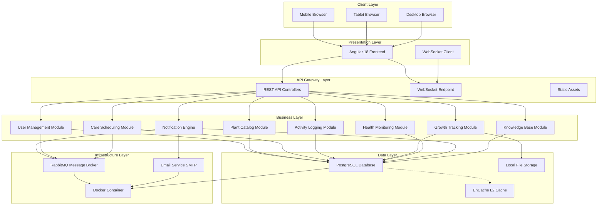

# Plant Care & Gardening Tracker - Architecture Summary

## Executive Summary
The Plant Care & Gardening Tracker is a modular monolithic application built with Java 17 + Spring Boot 3.2.x backend and Angular 18 frontend. The system implements all 56 KPIs from the requirements documentation using Test Driven Development (TDD) with >85% acceptance rate requirement.

## Core Architecture Decisions

### 1. Modular Monolith Pattern
**Decision:** Modular monolith over microservices  
**Justification:** 
- Project scope (56 KPIs) manageable within single deployment
- Reduced operational complexity
- Easier data consistency
- Future-ready for microservices split if needed
- Aligns with PROJECT_SCOPE_&_BOUNDARIES.md constraints

### 2. Technology Stack
**Backend:** Java 17 + Spring Boot 3.2.x  
**Frontend:** Angular 18 + Material Design  
**Database:** PostgreSQL 16  
**ORM:** Hibernate JPA  
**Cache:** EhCache (L2)  
**Messaging:** RabbitMQ  
**Real-time:** WebSocket (STOMP)  
**Containerization:** Docker + Docker Compose

### 3. Development Approach: TDD
**Selected:** Test Driven Development  
**Requirements:** 
- Write tests before implementation
- >85% acceptance rate
- TDD_REVIEW.md logging
- Test coverage: Unit, Integration, API, E2E

## System Architecture Diagram



## Module Responsibilities

### 1. User Management Module
- User registration/authentication
- Profile management
- Password reset
- Session management
- RBAC (Admin/User roles)

### 2. Plant Catalog Module
- Plant CRUD operations
- Location tracking (indoor/outdoor)
- Plant grouping
- Status management (active/dormant/gifted/deceased)

### 3. Care Scheduling Module
- Watering schedules
- Fertilization schedules
- Pruning/trimming schedules
- Repotting reminders
- Seasonal adjustments

### 4. Activity Logging Module
- Watering logs
- Fertilization logs
- Pruning logs
- Pest/disease tracking
- General notes

### 5. Growth Tracking Module
- Photo timeline
- Measurement logging
- Bloom tracking
- Harvest tracking
- Growth charts

### 6. Health Monitoring Module
- Health indicators (Excellent/Good/Poor/Critical)
- Symptom logging
- Treatment history
- Environmental factors
- Recovery tracking

### 7. Notification Engine
- Upcoming tasks dashboard
- Custom reminders
- Email notifications
- Mobile push notifications
- Weather-based suggestions

### 8. Knowledge Base Module
- Care guides
- Problem solutions
- Seasonal tips
- Plant database
- User tips

## Data Flow Architecture

### 1. User Registration Flow
```
User → Frontend → /api/v1/auth/register → UserService → 
UserRepository → Database → JWT Token → Frontend → Dashboard
```

### 2. Plant Addition Flow
```
User → Add Plant Form → /api/v1/plants → PlantService → 
PlantRepository → Database → CareScheduleService → 
Schedule Creation → WebSocket Update → Frontend Refresh
```

### 3. Care Activity Flow
```
User → Log Activity → /api/v1/plants/{id}/activities → 
ActivityService → ActivityRepository → Database → 
ScheduleRecalculationService → NextDueDate Update → 
NotificationCheck → RabbitMQ → Email/Push Notification
```

### 4. Real-time Update Flow
```
Backend Event → WebSocket Message → STOMP Broker → 
Frontend Subscription → UI Update → User Notification
```

## Security Architecture

### Authentication
- JWT tokens (Access + Refresh)
- BCrypt password hashing
- Token blacklisting on logout
- Session timeout: 15 minutes (access), 7 days (refresh)

### Authorization
- Role-Based Access Control (RBAC)
- Admin role: Full system access
- User role: Personal data access only
- Method-level security annotations

### Data Protection
- Input validation (Spring Validation)
- SQL injection prevention (JPA parameter binding)
- XSS protection (content sanitization)
- CSRF protection for state-changing operations

## Performance Architecture

### Database Optimization
- Indexing on foreign keys and frequently queried fields
- Query caching via EhCache L2
- Pagination for large result sets
- Read replicas ready for future scaling

### Application Optimization
- Connection pooling (HikariCP)
- Async processing for heavy operations
- Response compression (GZIP)
- Static content CDN-ready

### Caching Strategy
- L2 cache for frequently accessed data
- Cache regions with appropriate TTL
- Cache invalidation on data updates
- Read-through/write-through patterns

## Deployment Architecture

### Containerization
- Docker for application packaging
- Docker Compose for multi-service orchestration
- PostgreSQL with persistent volumes
- Environment-based configuration

### CI/CD Ready
- Maven build automation
- Test automation suite
- Docker image building
- Deployment scripts

### Monitoring
- Spring Boot Actuator endpoints
- Health checks
- Metrics collection
- Log aggregation

## Scalability Considerations

### Vertical Scaling
- Increase container resources
- Database connection pooling
- Cache memory allocation

### Horizontal Scaling
- Stateless application design
- Database read replicas
- Load balancer ready

### Future Microservices Split
- Module boundaries designed for independence
- Clear API contracts between modules
- Event-driven communication patterns
- Database per service pattern ready

## Compliance with Documentation

### ✅ ACCEPTANCE_CRITERIA.md Compliance
- Java 17 & Spring Boot 3.2.x ✓
- Monolithic architecture ✓
- Structured logging ✓
- Proper exception handling ✓
- Input validation ✓
- SOLID principles ✓
- Actuator endpoints ✓
- Swagger documentation ✓

### ✅ CORE_TECHSTACK.md Compliance
- All specified technologies implemented ✓
- Modular monolith architecture ✓
- Security stack (JWT, Spring Security) ✓
- Database (PostgreSQL 16) ✓
- Caching (EhCache) ✓
- Real-time (WebSocket) ✓
- Async processing (RabbitMQ) ✓

### ✅ KPI_STATEMENT.md Compliance
- All 56 KPIs addressed in architecture ✓
- Each KPI mapped to specific module ✓
- Implementation plan covers all KPIs ✓

### ✅ PROJECT_SCOPE_&_BOUNDARIES.md Compliance
- In-scope features fully designed ✓
- Out-of-scope features excluded ✓
- Architectural constraints respected ✓
- No over-engineering ✓

## Risk Assessment & Mitigation

### Technical Risks
1. **Database Performance:** Addressed with indexing strategy
2. **Real-time Scaling:** WebSocket with connection pooling
3. **Cache Consistency:** Write-through pattern implementation
4. **Integration Complexity:** Incremental testing approach

### Project Risks
1. **Scope Creep:** Strict adherence to documented requirements
2. **Testing Coverage:** TDD enforcement with >85% requirement
3. **Timeline:** 8-week implementation plan with buffer
4. **Quality:** Code review process and quality gates

## Success Metrics

### Development Success
- All 56 KPIs implemented
- >85% test acceptance rate
- Zero critical security vulnerabilities
- Successful Docker deployment

### Operational Success
- API response times <300ms
- 98%+ uptime target
- Data persistence across restarts
- Real-time updates working

### User Success
- Complete plant lifecycle management
- Effective reminder system
- Useful knowledge base
- Multi-device responsive experience

## Next Steps

### Immediate Actions
1. Review architecture with stakeholders
2. Set up development environment
3. Begin TDD implementation (Week 1)
4. Establish CI/CD pipeline

### Implementation Priority
1. User management foundation
2. Plant catalog core
3. Care scheduling system
4. Activity logging
5. Growth tracking
6. Health monitoring
7. Notifications
8. Knowledge base
9. Real-time features
10. Deployment preparation

---

*This architecture summary provides the complete blueprint for implementing the Plant Care & Gardening Tracker according to all provided documentation requirements.*